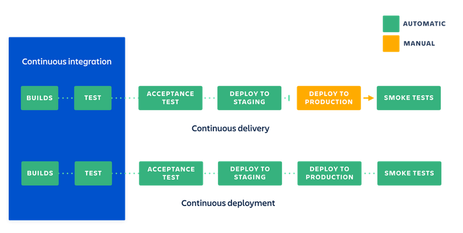

# Einführung und Grundlagen

## Continuous Delivery

Continuous Delivery beschreibt ein Verfahren zur automatischen erzeugen von Releases für Kunden im Rahmen eines [Software-Release-Prozesses](https://www.atlassian.com/agile/software-development/release). Dabei wird ein Software Projekt automatisch kompiliert, getestet und Build Artefakte ausgeliefert. Wichtig ist, dass die Software Entwicklung in iterativen Feedback Schleifen geschieht und die Software in kleinen Schritten weiter entwickelt wird.

Continuous Integration, Continuous Delivery und Continuous Deployment sind aufbauende Release-Prozesse, welche sich durch Erweiterungen unterscheiden:

- **Continuous Integration:** Änderungen an der Software werden so oft wie möglich in einen Haupt Branch via Git gepusht. Dort werden die Software automatisch kompiliert und getestet.
- **Continuous Delivery:** Zusätzlich zu den Schritten in Continuous Integration werden erstellte Build Artefakte an Kunden überliefert, beziehungsweise das Produkt *manuell* für Kunden bereitgestellt. Dazu sind zusätzliche Tests notwendig, um sicherzustellen, dass die entwickelte Software auch wirklich fehlerfrei für Kunden bereitsteht.
- **Continuous Deployment:** Die Schritte in Continuous Deployment sind die gleichen wie in Continuous Delivery mit dem Unterschied, dass das Endprodukt *automatisch* an Kunden überliefert und auf Produktivsystemen installiert wird.

>
>Unterschied zwischen Continuous Integration, Continuous Delivery und Continuous Deployment

## Anti Patterns

Hier ist eine Liste an Anti Patterns, welche durch diverse Vorgehensweisen behoben wurden:

- **Infrequent Check-In:** Source Code bleibt im lokalen Git Repository für zu lange Zeit. *Lösung:* Nach Absprache wird in diesem Projekt eine *trunked based* Git workflow verwendet, sodass mehr Übersicht über den Projektstand besteht. Zusätzlich werden immer nur kleine Änderungen (dafür häufiger) in Git gepusht.
- **Bottleneck Commits:** Code Änderungen werden nicht gepusht wodurch es zu Verzögerungen beim Testen und Integrieren der Software gibt. *Lösung:* Der Source Stand wird häufig aktualisiert und lokale Tests eingerichtet, damit der Code auch getestet werden kann, bevor die automatischen Tests gestartet werden.

## Referenzen

- [https://www.atlassian.com/de/continuous-delivery/principles](https://www.atlassian.com/de/continuous-delivery/principles)
- [https://www.atlassian.com/de/continuous-delivery/principles/continuous-integration-vs-delivery-vs-deployment](https://www.atlassian.com/de/continuous-delivery/principles/continuous-integration-vs-delivery-vs-deployment)
